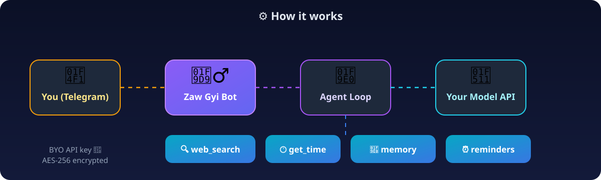

<div align="center">



[](https://nodejs.org)
[](https://telegraf.js.org)
[](https://sqlite.org)
[](LICENSE)
[](https://t.me/zawgyiclawbot)

**မြန်မာလို ပြောတဲ့ ကိုယ်ပိုင် AI Assistant — Telegram ပေါ်မှာ**

*Your own OpenClaw-style AI assistant. Bring your own model API key, chat in Burmese.*

**👉 Try it now: [@zawgyiclawbot](https://t.me/zawgyiclawbot)**

</div>

---

## ✨ Features

| | |
|---|---|
| 💬 | **Burmese-first chat** — natural Myanmar language persona (Zaw Gyi 🧙‍♂️) |
| 🔑 | **BYO model API** — connect *your own* OpenAI-compatible key (`/setapi`) |
| 🔐 | **AES-256-GCM encrypted** — API keys never stored in plaintext |
| 🧠 | **Agent loop + tools** — web search, Myanmar time, memory, reminders |
| 🔍 | **Live web search** — answers grounded in real-time results |
| ⏰ | **Reminders** — `/remind` with cron-powered delivery |
| 🆓 | **Freemium** — free tier: 100 AI messages / user / day |
| 👑 | **Admin tools** — `/stats`, `/broadcast` (owner only) |



## ⚙️ How it works



1. You message the bot on Telegram
2. Zaw Gyi plans with **your** model API (function-calling agent loop)
3. It calls tools — web search, memory, time, reminders — then replies in Burmese

## 🚀 Quick start

```bash
git clone https://github.com/mymyanmarland/zawgyi-claw-bot.git
cd zawgyi-claw-bot
npm install
cp .env.example .env   # fill in TELEGRAM_BOT_TOKEN, ZAWGYI_MASTER_KEY, TELEGRAM_OWNER_ID
npm start
```

### Environment

| Variable | Description |
|---|---|
| `TELEGRAM_BOT_TOKEN` | Bot token from [@BotFather](https://t.me/BotFather) |
| `TELEGRAM_OWNER_ID` | Your Telegram user ID (admin commands) |
| `ZAWGYI_MASTER_KEY` | 32-byte hex key for AES-256-GCM encryption |
| `PORT` | HTTP port (default `3012`) |

### Connect your model

In Telegram, send the bot:

```
/setapi <base_url> <api_key> <model>
```

Example:

```
/setapi https://api.openai.com/v1 sk-... gpt-4o-mini
```

Then `/testapi` to verify, and just chat! 💬

## 🤖 Bot commands

| Command | Description |
|---|---|
| `/start` | Welcome + onboarding |
| `/setapi <url> <key> <model>` | Connect your model API (encrypted) |
| `/testapi` | Test your API connection |
| `/myapi` / `/removeapi` | View / remove your API config |
| `/remember <fact>` | Save a fact to memory |
| `/memory` / `/forget <n>` | View / delete memories |
| `/remind <time> <text>` | Set a reminder (`10m`, `2h`, `မနက် ၈နာရီ`) |
| `/reminders` | List your reminders |
| `/new` | Clear conversation context |
| `/stats` / `/broadcast` | 👑 Owner only |

## 🛠️ Tech stack

- **Runtime:** Node.js 22
- **Bot framework:** Telegraf (long polling)
- **HTTP:** Express (`/health` endpoint)
- **Database:** SQLite (`node:sqlite`, zero-config)
- **Crypto:** AES-256-GCM (per-user API keys)
- **Agent:** OpenAI-style function calling loop
- **Scheduler:** node-cron

## 🗺️ Roadmap

- [ ] 🌐 Web setup page (safer API key onboarding)
- [ ] 💳 Paid tiers + payments
- [ ] 📊 Web dashboard
- [ ] 💬 WhatsApp channel
- [ ] 🎙️ Voice messages
- [ ] 🖼️ Photo / file understanding
- [ ] 👥 Group chat support

## 📄 License

MIT — build something magical. 🧙‍♂️

---

<div align="center">

**Made with ❤️ in Myanmar 🇲🇲**

*ဇော်ဂျီ — မြန်မာ့ရိုးရာ မှော်ဆရာ, အခု AI ခေတ်မှာ ပြန်လည်မွေးဖွားခြင်း*

</div>
